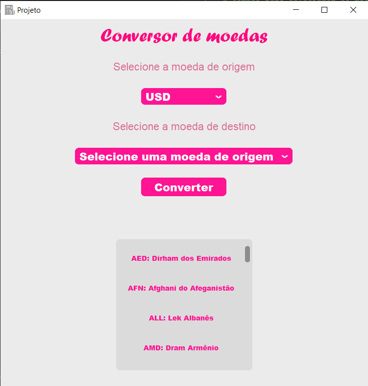

# Conversor Monetário
 
## Converte diversas moedas baseado em código Python
 
Bem vindo ao conversor monetário. Esse projeto foi criado para fins didáticos com o objetivo dos alunos aprenderem a manusear as linhas de código Python com um projeto de simples desenvolvimento. O projeto criado em questão, converte valores para os mais diversos tipos de moedas com uma API de cotações para fazer as conversões em tempo real. O projeto também faz o uso da biblioteca Customtkinter para a criação da janela.
 
## Funcionalidades
 
- Campos para seleção das moedas: moeda de origem e moeda de destino e botão para converter;
- Dicionário de moedas - siglas e seus significados;
- Conversão de mais de 150 moedas;
- Muito utilizável para saber o valor de uma moeda, por exemplo de dólar para real ou vice-versa;
- Utilizar como aplicativo executável.
## Instalação
Para a Instalação desse aplicativo, é necessário ter instalado em sua máquina a versão 3.12 do Python, além de um programa para abrir o código e executa-lo. Além disso, é necessário fazer o download dessas bibliotecas para que o código possa ser executado:
### Pré-requisitos necessários
 
- customtkinter
- requests
- xmltodict
 
#### Como fazer o download dessas bibliotecas:
 
##### customtkinter
 
```bash
  pip install customtkinter
```
 
##### requests 
```bash
  pip install requests
```
 
##### xmltodict
 
```bash
  pip install xmltodict
```
 
Para ter acesso do aplicativo em seu git hub ou em sua máquina, use o seguinte código:
 
```bash
  git clone 
```

## Screenshots
!
 
 
## Aprendizados
 
Com realização desse trabalho tivemos a oportunidade de obter um maior aprendizado a cerca do desenvolvimento da programação em python, com importações de bibliotecas, ensinamento de realização de funções e novos comandos, interligação de arquivos, customização de janelas, interligação de links e ocutar arquivos, além de aprendizados interdiciplinares, como o entendimento sobre conversoes monetários e o contato com as siglas oficiais de moedas. 
Além disso, também aprendemos a utilizar a ferramenta GitHub, seus comandos básicos e como criar um repositório nesta ferramenta. 
## Autores
 
Alunos do V itinerário de Desenvolvimento de Sistemas - Grupo 2:
 
- Giovana Queiros Maciel
- Maria Eduarda Munaro da Silva
- Otávio Henrique Barbosa
- Polyana Kaory Batista Suzuki